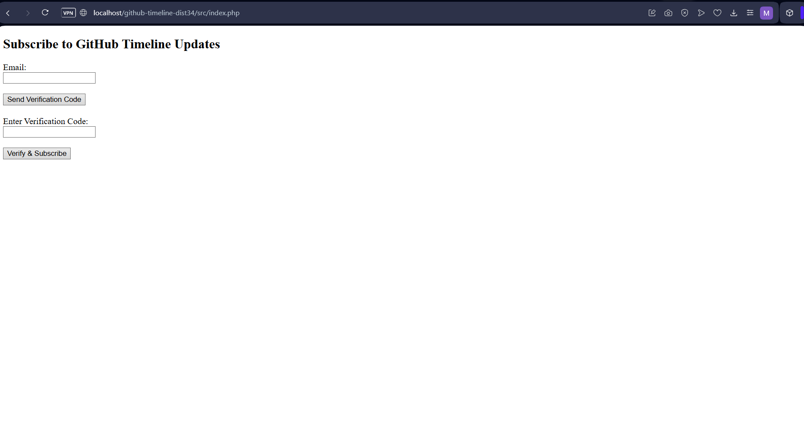
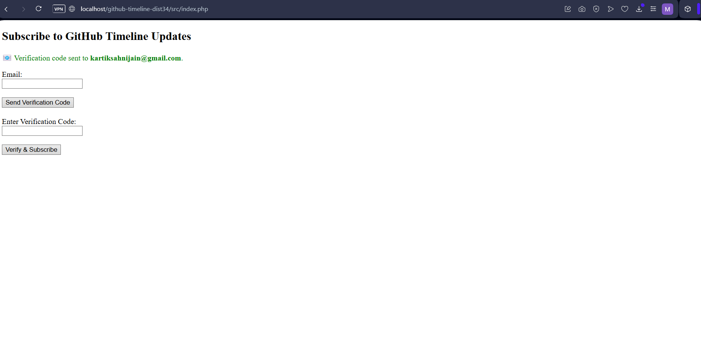
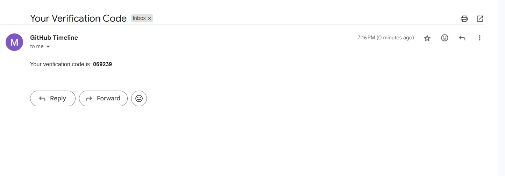
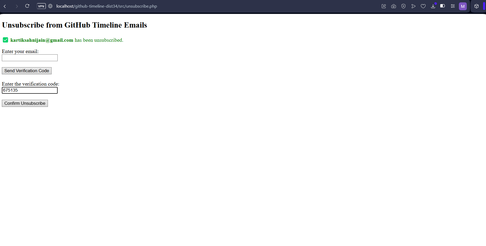
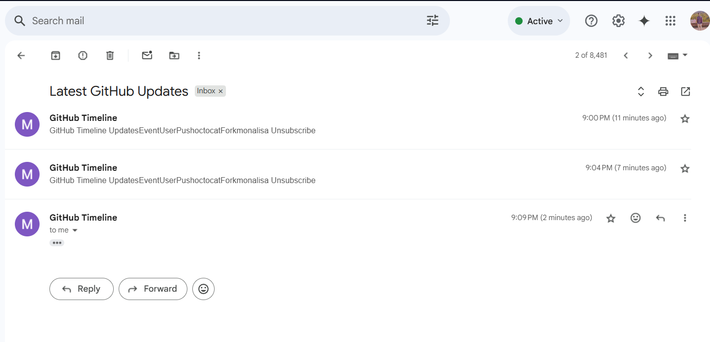
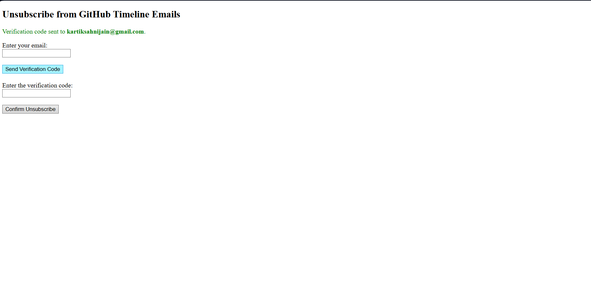

# 📬 GitHub Timeline Email Subscription (Pure PHP)

A pure PHP-based email verification system where users can subscribe to receive periodic GitHub timeline updates via email. No database or frameworks — uses only flat files and native PHP. A CRON job (or Task Scheduler on Windows) runs every 5 minutes to send out formatted update emails.

> ✅ No frameworks · No external libraries · No database · Fully file-based

---

## 📁 Folder Structure

```plaintext
src/
├── index.php               # Subscription form
├── unsubscribe.php         # Unsubscribe form
├── functions.php           # Core logic (verification, email, etc.)
├── cron.php                # Sends GitHub timeline updates to users
├── runcron.bat             # Schedules cron.php every 5 mins (Windows Task Scheduler)
├── registered_emails.txt   # Stores verified user emails
---

## ✅ Features

- 🔒 Email verification using 6-digit code  
- 📩 GitHub updates via HTML emails  
- 🔁 CRON job every 5 minutes (Windows Task Scheduler or Linux crontab)  
- ❌ Unsubscribe flow with verification  
- 🧑‍💻 Pure PHP only — no libraries, no JavaScript  
- 📜 No database — uses flat file (`registered_emails.txt`)  

---

## 🖼️ Functional Output Screenshots

### 1️⃣ Subscription Form

User enters email and verification code.



---

### 2️⃣ Verification Code Sent Message

After entering email, a message is shown confirming the code was sent.



---

### 3️⃣ Email with Verification Code

An actual email the user receives.



---

### 4️⃣ User Successfully Subscribed

After submitting correct code.



---

### 5️⃣ CRON Running Every 5 Minutes

Demonstrates working scheduled task or crontab.



---

### 6️⃣ GitHub Timeline HTML Email

Email content sent every 5 minutes — includes event/user table.


---

### 7️⃣ Unsubscribe Form

Users enter their email to unsubscribe, and receive a code.



---

### 8️⃣ User Successfully Unsubscribed

Confirmation after entering code.


---

## 🧑‍💻 How to Run on Windows (XAMPP)

1. Move the project to: C:\xampp\htdocs\github-timeline-dist34\
2. Start **Apache** in XAMPP.
3. Open browser:http://localhost/github-timeline-dist34/src/index.php
4. Enter a real email. You’ll receive a 6-digit code.
5. Once verified, your email is saved in `registered_emails.txt`.
6. `runcron.bat` automatically schedules `cron.php` to run every 5 mins using Task Scheduler.
7. GitHub updates will be sent to verified users periodically.

---

## 🛑 Unsubscribe Instructions

1. Click the **Unsubscribe** link in the email.

2. You’ll be redirected to `unsubscribe.php`.

3. Enter your email and received code.

4. If it's the last user, the CRON task is removed using `stopcron.bat`.

---

## 🔒 Email Content Format

- **Subject:** `Your Verification Code`
- **Body:**  
```html
<p>Your verification code is: <strong>123456</strong></p>
Sender: Your custom email (e.g. yourname@gmail.com)
Content Type: HTML formatted

# ⚙️ CRON Functionality – GitHub Timeline Email Subscription

This project uses a scheduled **CRON-like system** to automatically fetch and send GitHub timeline updates via email every 5 minutes to all verified users. On **Windows**, this is implemented using **Task Scheduler**, triggered through a `.bat` file.

---

## 🧩 What is Scheduled?

- `cron.php` is the script responsible for:
  - Reading verified users from `registered_emails.txt`
  - Generating  GitHub timeline updates
  - Sending HTML-formatted emails with update tables
  - Including an unsubscribe link in each email

---

## 🪟 CRON Setup on Windows (Task Scheduler)

### 🔁 `runcron.bat`

- This batch file registers a Windows **Task Scheduler** job called `GitHub.CRON`.
- It runs `cron.php` every 5 minutes indefinitely.
- This file is automatically triggered after successful email verification (inside PHP code).

📄 Example Code in `runcron.bat`:

```bat
schtasks /Create /SC MINUTE /MO 5 /TN GitHub.CRON /TR "php.exe path\to\cron.php" /F


